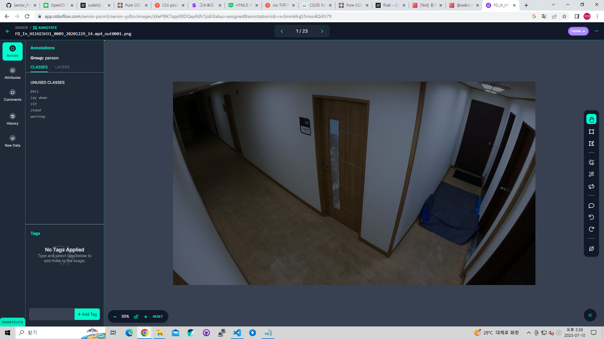
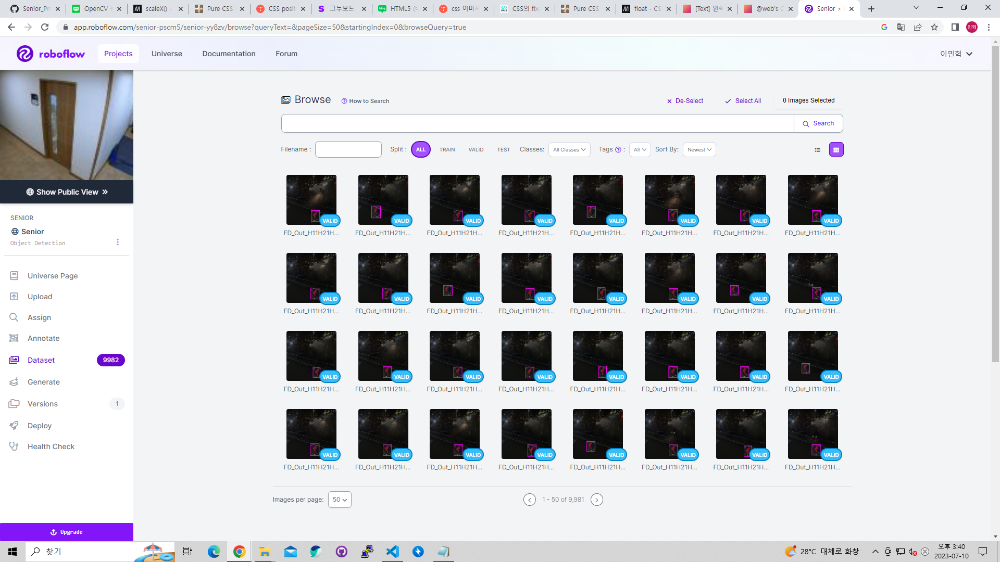

# 2023-07-04 (화)

> TODO
1. YOLOv7 Custom_Model을 위한 데이터 라벨링 및 데이터 정제 (IMG 10,000장)

> 개인 TODO
- 이민혁 : 데이터라벨링, Git hub 작성
- 원설아 : 데이터라벨링
- 이은전 : 데이터라벨링
- 정유찬 : 데이터라벨링

> roboflow를 사용하여 데이터 라벨링
- 10,000장 라벨링을 수행

