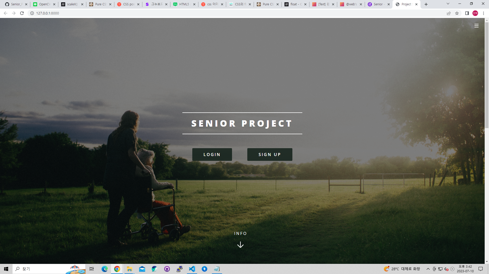
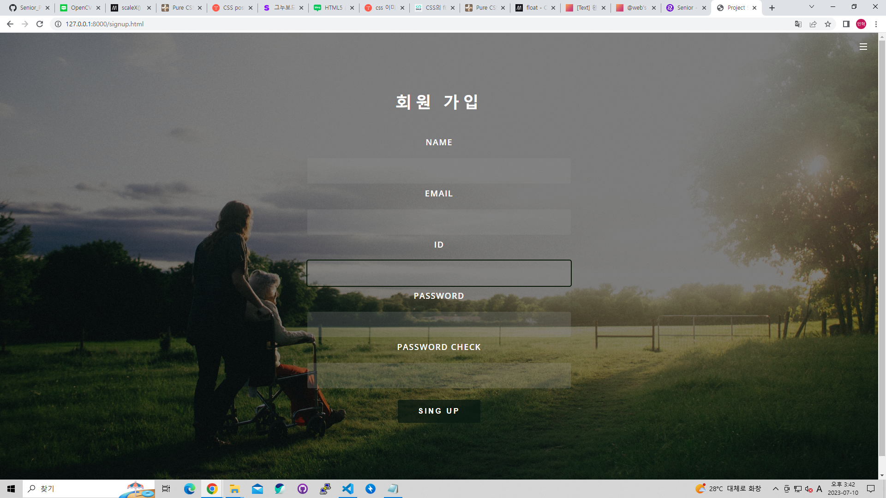
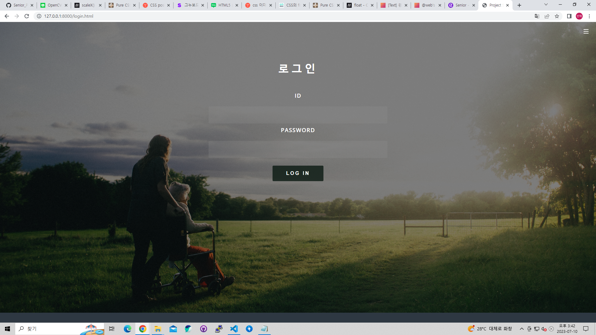

# 2023-07-05 (수)

> TODO
1. COLAB으로 라벨링 데이터셋 학습 방법 알아보기
2. Web Site [Front : 전체적인 CSS 수정, 회원가입 및 로그인 페이지 생성, CCTV 페이지에 영상 이미지 규격 확인]
3. Web Site [Backend : FAST API로 서버 구축 및 회원가입 로직 작성, 데이터 베이스 회원 가입 정보 저장]

> 개인 TODO
- 이민혁 : Backend, Git hub 작성
- 원설아 : Front[전체적인 CSS 수정], COLAB 학습 방법 알아보기
- 이은전 : Front[CCTV 페이지에 영상 올리고 규격 확인] 
- 정유찬 : AI HUB 자료 조사

> ROBOFLOW 데이터셋으로 COLAB 환경에서 학습 방법
- ROBOFLOW 사이트에서 학습 방법 확인 후 코드 확인

> Front
- 전체적인 구성 및 CSS 수정
- 영상 데이터 업로드 확인 및 규격 조정
- 회원 가입 페이지 및 로그인 페이지 생성 (HTML, CSS)
- 회원 가입 기능 구현 (FAST API, JavaScript)

