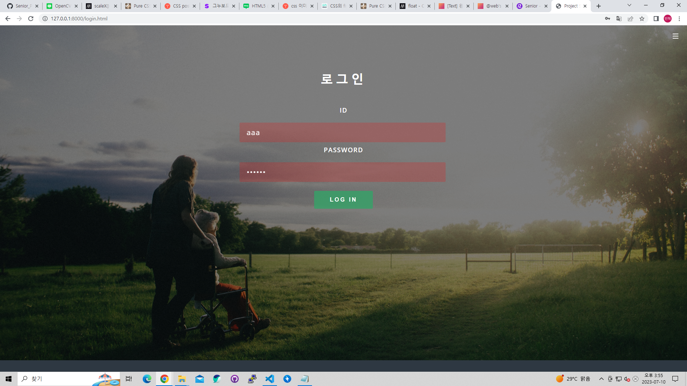

# 2023-07-06 (목)

> TODO
1. YOLOv7 MODEL 학습 테스트
2. Web Site [발표페이지 정리, 로그인 페이지 로직 작성, 데이터 베이스를 활용하여 로그인 확인]
3. 아이디어 회의

> 개인 TODO
- 이민혁 : 로그인, 모델 학습 테스트, Git hub 작성
- 원설아 : Web Site [발표페이지 정리]
- 이은전 : Web Site [발표페이지 정리]
- 정유찬 : Arduino로 스피커와 서브모터 제어

> YOLOv7 MODEL Local 환경에서 학습 테스트
- 전체적인 로컬 환경 버전 확인 및 라이브러리 재설치 후 테스트

> Web
- 발표 페이지 정리
- 로그인 기능 구현

