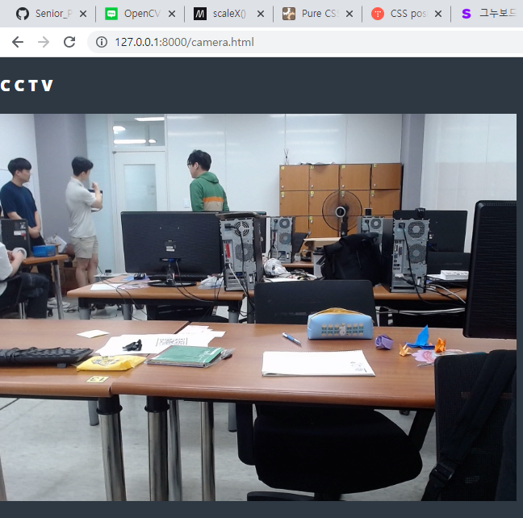
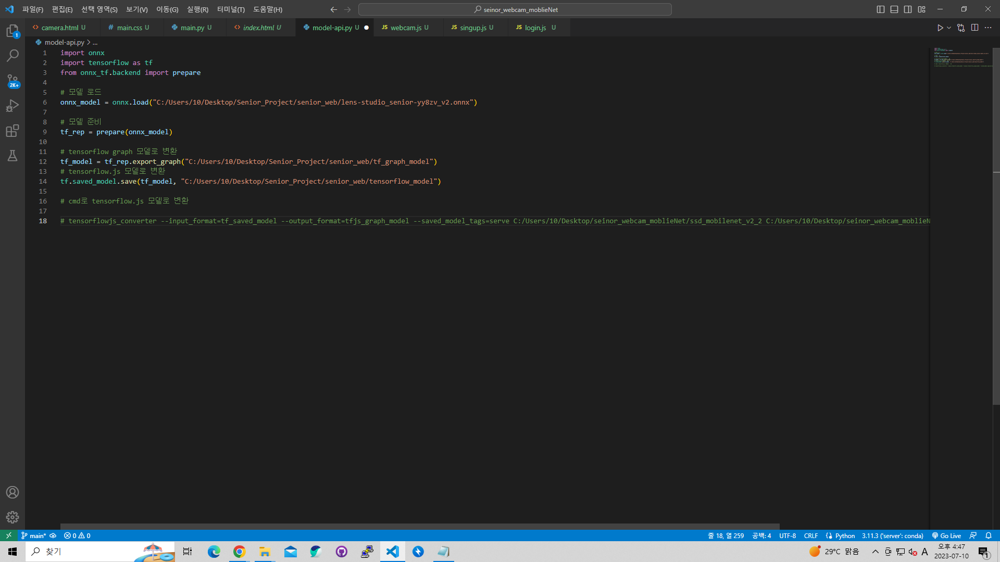

# 2023-07-07 (금)

> TODO
1. YOLOv7 MODEL 학습 테스트 (진행 중)
2. Web Site [CCTV 화면과 같이 학습된 모델로 실시간 웹캠 가져오기]
3. 영상파일을 학습된 모델을 활용해서 영상에 적용 및 JSON 파일로 데이터 변환

> 개인 TODO
- 이민혁 : Web Site [CCTV 화면과 같이 학습된 모델로 실시간 웹캠 가져오기], Git hub 작성
- 원설아 : 영상파일을 학습된 모델을 활용해서 영상에 적용 및 JSON 파일로 데이터 변환
- 이은전 : ROBOFLOW 영상 확인 및 모델 인식률 테스트
- 정유찬 : JSON 파일 Parsing

> YOLOv7 MODEL Local 환경에서 학습 테스트
- 테스트 진행 중

> Web
- 학습된 모델을 이용해서 브라우저에 웹캠을 사용하는 것을 테스트 중
- Roboflow Model(ONNX 모델) -> Tensorflow Model 변환 -> Tensorflow.js Model 변환 후 사용
- ONNX Model -> Tensorflow Model 변환은 Python Code로 변환이 되었지만 Tensorflow.js 모델 변환이 어려움
- Tensorflow Model -> Tensorflow.js Model로 변환은 CMD에서 변환 성공 

> Data
- 영상파일을 학습된 모델을 활용해서 영상에 적용 및 JSON 파일로 데이터 변환

