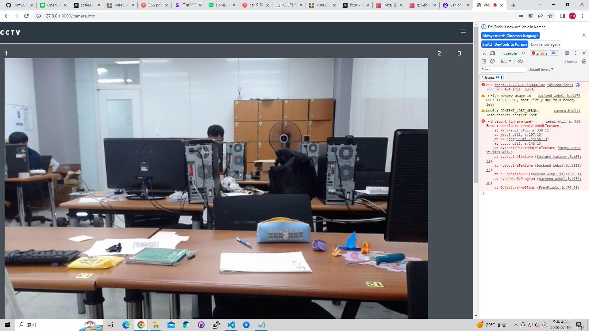
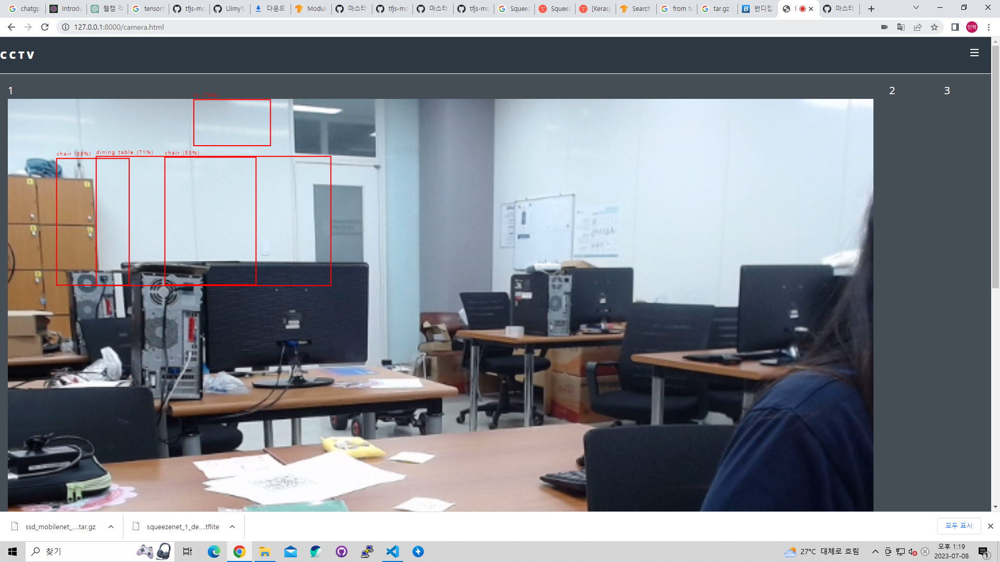

# 2023-07-08 (토)

> TODO
1. YOLOv7 MODEL 학습 테스트 (진행 중)
2. Web Site [CCTV 화면과 같이 학습된 모델로 실시간 웹캠 가져오기]
3. 영상파일을 학습된 모델을 활용해서 영상에 적용 및 JSON 파일로 데이터 변환
4. DOT MATRIX 사용법 확인

> 개인 TODO
- 이민혁 : Web Site [CCTV 화면과 같이 학습된 모델로 실시간 웹캠 가져오기], Git hub 작성
- 원설아 : 영상파일을 학습된 모델을 활용해서 영상에 적용 및 JSON 파일로 데이터 변환
- 이은전 : ROBOFLOW 영상 확인 및 모델 인식률 테스트
- 정유찬 : DOT MATRIX 사용법 확인

> YOLOv7 MODEL Local 환경에서 학습 테스트
- 테스트 진행 중

> Web
- 학습된 모델을 이용해서 브라우저에 웹캠을 사용하는 것을 테스트
- 학습된 모델의 GPU 메모리 사용량이 많아 웹 화면에 로드가 안되서 기본 객체인식 경량화 모델(coco-ssd)로 교체
- 경량화 모델(coco-ssd)로 교체 후 바운딩 박스 위치가 맞지 않는 부분 수정(CSS 수정)

> Data
- 영상파일을 학습된 모델을 활용해서 영상에 적용 및 JSON 파일로 데이터 변환

> DOT MATRIX
- 전광판처럼 Serial 통신으로 값이 도달하면 그에 맞는 문구 출력

