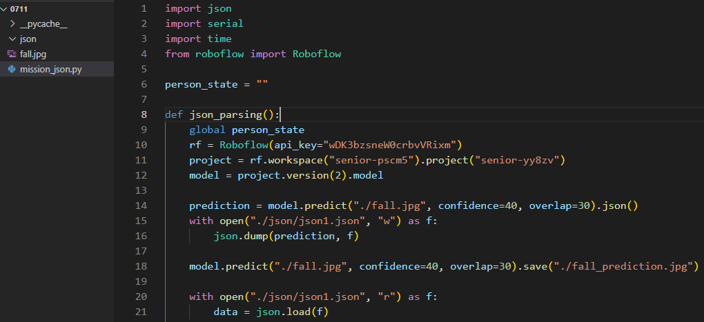
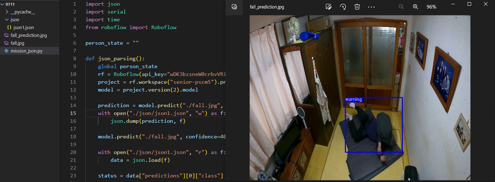

# 2023-07-10 (월)

> TODO
1. YOLOv7 MODEL 학습 테스트 (진행 중)
2. Web Site [CCTV 화면과 같이 학습된 모델로 실시간 웹캠 가져오기]
3. 이미지를 학습된 모델을 활용해서 이미지에 적용 및 JSON 파일로 데이터 변환

> 개인 TODO
- 이민혁 : Web Site [CCTV 화면과 같이 학습된 모델로 실시간 웹캠 가져오기], Git hub 작성
- 원설아 : 실시간 웹캠 Layout 정리, Log 띄우기 (HTML, CSS)
- 이은전 : 이미지를 학습된 모델을 활용해서 이미지에 적용 및 JSON 파일로 데이터 변환
- 정유찬 : 휴가

> YOLOv7 MODEL Local 환경에서 학습 테스트
- 테스트 진행 중

> Web
- 학습된 모델을 이용해서 브라우저에 웹캠을 사용하는 것을 테스트
- 경량화 모델(coco-ssd)로 교체 후 바운딩 박스 위치가 맞지 않는 부분 수정(HTML, CSS 수정)

> Data
- 이미지를 학습된 모델을 활용해서 이미지에 적용 및 JSON 파일로 데이터 변환

