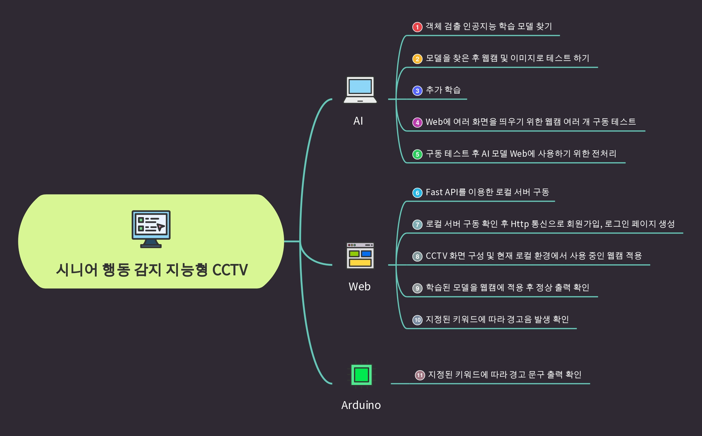
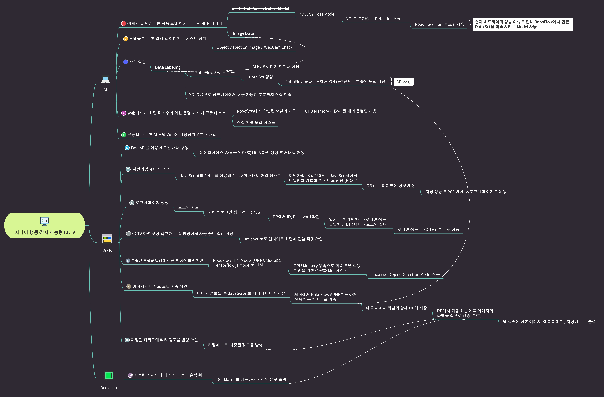
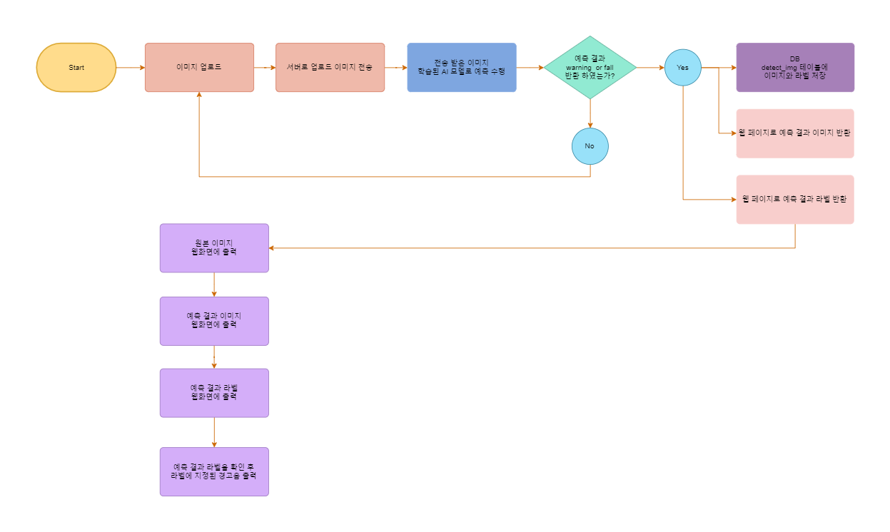
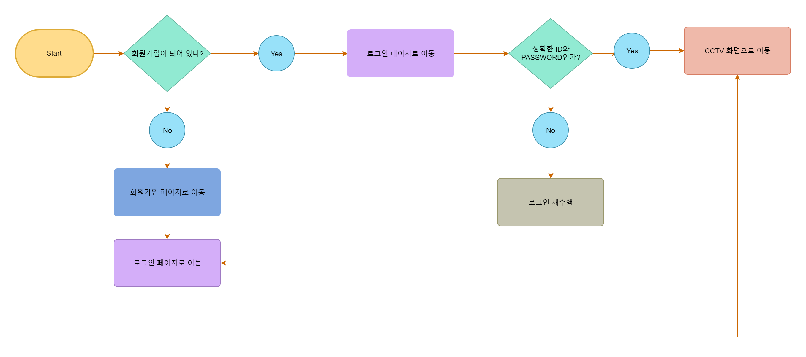

<h1>시니어 행동 감지 지능형 CCTV</h1>
<br>

> <h2>🧑‍💻 팀장 및 팀원 정보</h2>
- 팀장 : 이민혁
- 팀원 : 원설아, 이은전, 정유찬

> <h2>⚙ 개발 환경</h2>
- 운영체제 : ```Window```
- 통합개발환경(IDE) : ```VS Code```
- CUDA 버전: ```CUDA 10.1```
- CUDNN 버전: ```CUDNN 7.6```
- Anaconda: ```Miniconda3```
- 관리 툴: ```GitHub```

> <h2>🗃 기술 스택</h2>
- ```YOLOv7```
- ```OpenCV```
- ```tensorflow-gpu```
- ```Python```
- ```FAST API```
- ```Arduino```
- ```Html```
- ```CSS```
- ```Javascript```
- ```jquery```
- ```SQLite```

> <h2>📋 프로젝트 소개 및 구조</h2>
- [AI-HUB](https://www.aihub.or.kr/) 데이터의 [시니어 이상행동 영상 모델](https://www.aihub.or.kr/aihubdata/data/view.do?currMenu=115&topMenu=100&aihubDataSe=realm&dataSetSn=167)을 활용하여 요양원의 시니어 낙상 및 배회 등을 빠른 대처를 위한 스마트 지능형 CCTV 기능 구현
- 스마트 지능형 CCTV로 위험 발생 시 연동된 스피커로 상황별 안내 방송을 시작하고 경고등이 켜지는 구조
- 사용자 : 웹 CCTV 화면은 CCTV로 들어오는 화면을 회원가입을하면 SQLITE3 DB에 저장이 되고 로그인을 하면 화면을 볼 수 있는 구조

> <h2>Flow Chart</h2>
- 초기 설계 (first flow chart)


- 최종 Flow Chart


- AI Model Flow Chart


- Login Flow Chart

